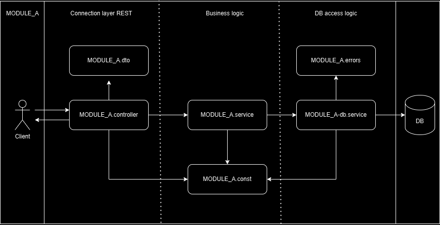
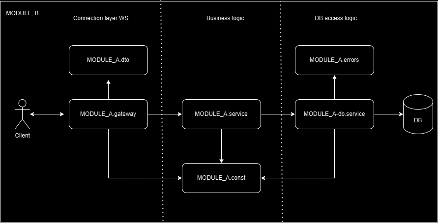

# Estructura de un módulo

Los módulos se dividen en 3 capas principales:

### Capa de conexión.
Esta capa se encarga de la comunicación con el cliente y la validación de los datos recibidos, puede ser mediante REST utilizando un controller o WS utilizando un gateway dependiendo el módulo.

### Capa de lógica de negocio la cual.
Esta capa aplica las reglas solicitadas por el cliente, y gestiona las respuestas y errores, sin importar la implementación de base de datos que tenga el sistema.

### Capa de conexión a la base de datos.
Esta capa se encarga de la comunicación e implementación de una DB especifica, permitiendo una simple migración en caso que se desee cambiar el proveedor de DB.

## Estructura de un modulo REST

## Estructura de un modulo WS
