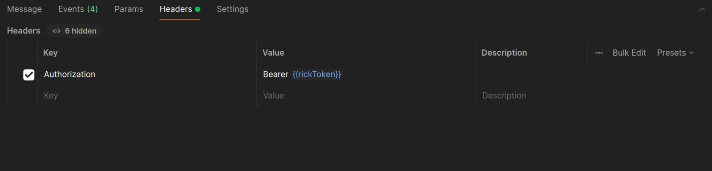
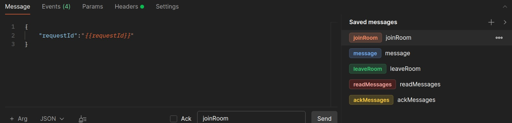
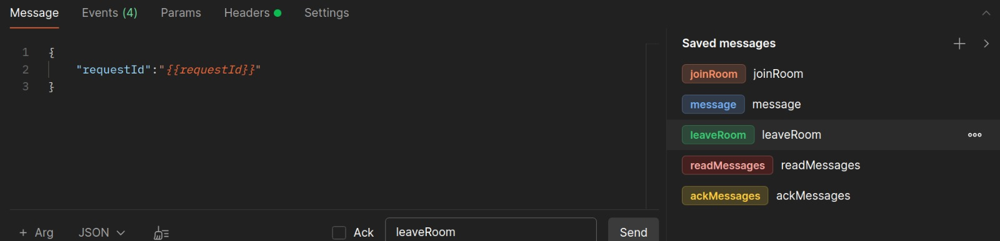
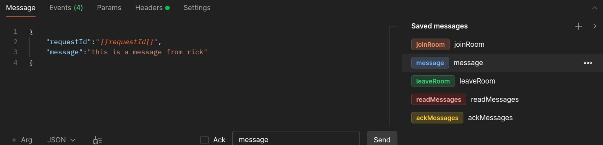
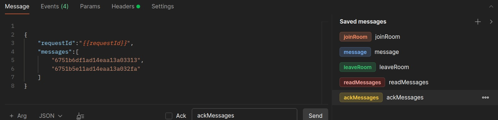
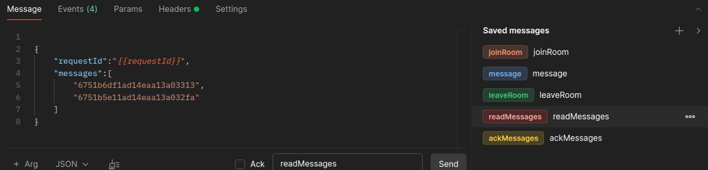
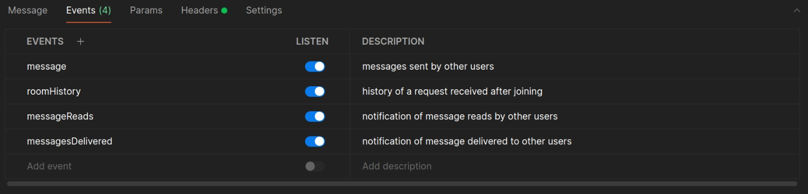

# Comunicación por websockets

## Conexión a la API
Para conectarse a la API de websockets es necesario enviar un `Bearer Token` de tipo `JWT` a traves del header `Authorization`.

Solo se considerarán mensajes válidos para un pedido aquellos que sean enviados por un usuario que cumpla una de las siguientes:
- El usuario posee el rol profesor (TEACHER) y es el generador del pedido.
- El usuario posee el rol de laboratorio (LAB). 

## Mensajes entrantes soportados

La API provee los siguientes mensajes que el cliente puede enviar:

### Angresar a una sala

#### Mensaje: joinRoom
#### Ejemplo: { "resquestId":"6751b6df1ad14eaa13a03313" }
#### Parámetros:

|Clave | Es requerido| Descripción | Tipo | Valor de ejemplo |
|------|-------------|-------------|------|------------------|
|requestId| Si. | ID de un pedido. | Mongo ObjectId | 6751b6df1ad14eaa13a03313 |

### Abandonar una sala

#### Mensaje: leaveRoom
#### Ejemplo: { "resquestId":"6751b6df1ad14eaa13a03313" }
#### Parámetros:

|Clave | Es requerido| Descripción | Tipo | Valor de ejemplo |
|------|-------------|-------------|------|------------------|
|requestId| Si. | ID de un pedido. | Mongo ObjectId | 6751b6df1ad14eaa13a03313 |

### Enviar un mensaje a una sala

#### Mensaje: message
#### Ejemplo: { "resquestId":"6751b6df1ad14eaa13a03313", "message":"this is a message from a client" }
#### Parámetros:

|Clave | Es requerido| Descripción | Tipo | Valor de ejemplo |
|------|-------------|-------------|------|------------------|
|requestId| Si. | ID de un pedido. | Mongo ObjectId | 6751b6df1ad14eaa13a03313 |
|message | Si. | Mensaje a enviar. | String | "this is a message from a client"|

### Marcar mensajes como recibidos

#### Mensaje: ackMessages
#### Ejemplo: { "requestId":"6751b6df1ad14eaa13a03313", "messages":["6751b6df1ad14eaa13a03313","6751b5e11ad14eaa13a032fa"] }
#### Parámetros:

|Clave | Es requerido| Descripción | Tipo | Valor de ejemplo |
|------|-------------|-------------|------|------------------|
|requestId| Si. | ID de un pedido. | Mongo ObjectId | 6751b6df1ad14eaa13a03313 |
|messages | Si. | Arreglo de IDs de mensajes a marcar como recibidos. | Array<Mongo ObjectID> | ["6751b6df1ad14eaa13a03313","6751b5e11ad14eaa13a032fa"] |

### Marcar mensajes como leidos

#### Mensaje: readMessages
#### Ejemplo: { "requestId":"6751b6df1ad14eaa13a03313", "messages":["6751b6df1ad14eaa13a03313","6751b5e11ad14eaa13a032fa"] }
#### Parámetros:

|Clave | Es requerido| Descripción | Tipo | Valor de ejemplo |
|------|-------------|-------------|------|------------------|
|requestId| Si. | ID de un pedido. | Mongo ObjectId | 6751b6df1ad14eaa13a03313 |
|messages | Si. | Arreglo de IDs de mensajes a marcar como recibidos. | Array<Mongo ObjectID> | ["6751b6df1ad14eaa13a03313","6751b5e11ad14eaa13a032fa"] |

## Mensajes salientes soportados

La API provee los siguientes mensajes a los que el cliente puede suscribirse:

|Mensaje | Se obtiene cuando | Descripción | 
|--------|-------------------|-------------|
|message| Otro cliente envía un mensaje y el servidor lo replica. | Mensaje enviado por otro usuario. |
|roomHistory | Se conecta correctamente a una sala. | Historial de mensajes del pedido. |
|messagesDelivered | Un usuario informa que ha recibido un mensaje y el servidor lo replica. | Acuse de recibo de un mensaje por parte de otro usuario. |
|messageReads | Un usuario informa que ha leido mensajes y el servidor lo replica. | Notificación de lectura de un mensaje por parte de otro usuario. |

